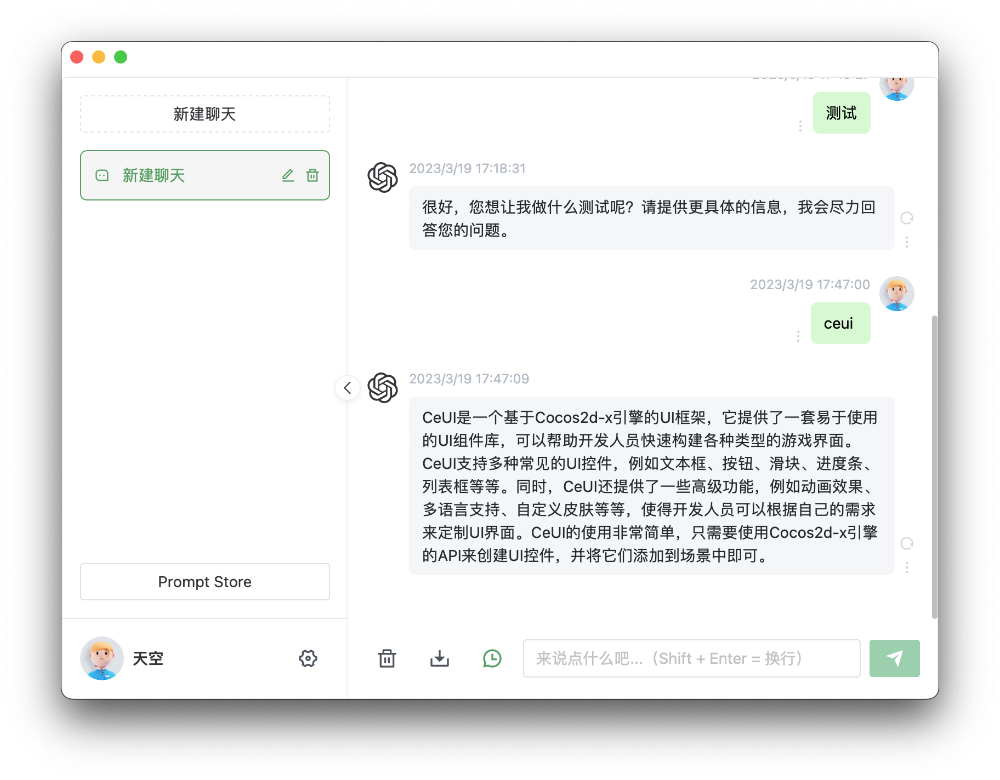

# ChatGPT Tauri
ChatGPT 桌面客户端，基于 [chatgpt-web](https://github.com/Chanzhaoyu/chatgpt-web)。

__该客户端仅支持 open-api 的方式使用__

## 预览




## 介绍

### 开发

```bash
pnpm i

# 开发
pnpm tauri dev

# 打包
pnpm tauri build
```


## 感谢

- 感谢 [chatgpt-web](https://github.com/Chanzhaoyu/chatgpt-web) 项目作者以及所有该项目的贡献者。

## 赞助

如果您觉得该项目对你有帮助，可以给我打赏一杯咖啡，感谢！


# License
MIT